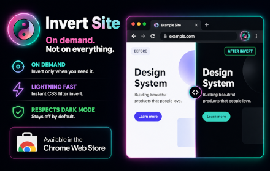

  
  <h1>Invert Site</h1>
  
  
<strong>Off by default. One click when a site ignores dark mode.</strong>

  
Alt+I or the toolbar icon. No stored state.

---

Chrome dark mode covers most pages. Invert Site stays off and lets it. Some sites ignore your dark mode preference. Others keep a bright background image. Click or press Alt+I to invert the tab. Simple. Nothing stored.

<a href="https://chromewebstore.google.com/detail/invert-site/hnnilolmcicknmmpkccoflolnopdgkgf">
  <b>Install</b>
   
  
</a>

---

## Developers

1. Open `chrome://extensions`
2. Enable Developer mode
3. Load unpacked → select this repo
4. Open a page, press `Alt+I` or click the icon

## Privacy

[Privacy policy](PRIVACY.md)

---

## License

[MIT](LICENSE)
